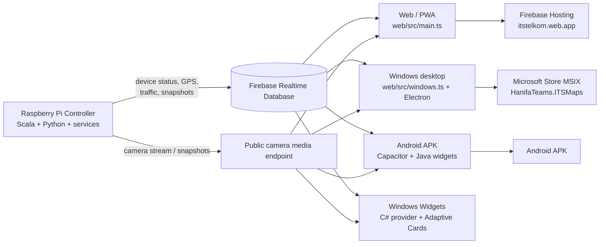
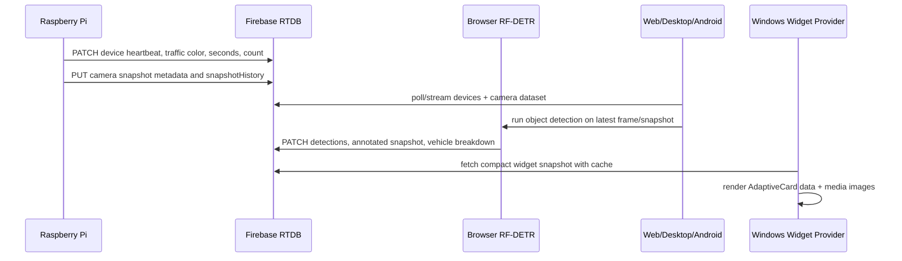

# ITS Maps

ITS Maps is a realtime traffic, campus-map, camera, and AI object-detection dashboard for the ITS / Telkom University deployment. The same codebase powers:

- a Firebase-hosted web application,
- an Android APK built with Capacitor and native Java widgets,
- a Windows desktop/MSIX application built with Electron,
- four Windows 11 Widget Board widgets implemented as Adaptive Cards with a C# widget provider,
- a Raspberry Pi controller stack for camera, GPS, heartbeat, and traffic-light telemetry.

Developer: **Hanifa Septhi Larasati / Hanifa Teams**.

## High-Level Architecture



## Runtime Data Model

The central runtime state is normalized around one active device record.

```ts
DeviceRecord {
  id, name, status, position, lastSeen,
  trafficColor, redSeconds, yellowSeconds, greenSeconds,
  vehicleCount, vehicleBreakdown,
  cameraSnapshotUrl, cameraAnalysisSnapshotUrl,
  detections, cameraDataset
}
```

Important data sources:

- Firebase RTDB device state: `https://itstelkom-default-rtdb.asia-southeast1.firebasedatabase.app/devices.json`
- Firebase RTDB snapshot history: `snapshotHistory.json`
- Firebase RTDB desktop clients/user location: `desktopClients.json`
- Public privacy policy: `web/public/privacy/index.html`
- Static fallback snapshots/config: `web/public/data/its-state.json` and `web/public/data/its-config.json`

## Realtime Pipeline



## Mathematical Notes

### Device freshness

A device is considered online when its last heartbeat is recent:

```math
\Delta t = t_{now} - t_{lastSeen}
```

```math
online(d) =
\begin{cases}
1, & \Delta t \le T_{offline}\\
0, & \Delta t > T_{offline}
\end{cases}
```

The thresholds are implemented in TypeScript (`OFFLINE_AFTER_MS`, `CAMERA_STATUS_FRESH_MS`, and `CAMERA_SNAPSHOT_FRESH_MS`) and mirrored in the widget providers.

### Vehicle count

The displayed total is the sum of available per-class telemetry:

```math
N_{vehicle}=N_{car}+N_{motorcycle}+N_{bus}+N_{truck}+N_{bicycle}
```

When AI detections are available, vehicle-like detections are normalized to the same classes. When RTDB already provides controller counts, the UI prioritizes RTDB data.

### Bounding-box projection

AI detections use normalized or image-space boxes. Rendering projects a box from source image size to display size:

```math
x' = x \cdot \frac{W_{view}}{W_{src}},\quad
y' = y \cdot \frac{H_{view}}{H_{src}}
```

```math
w' = w \cdot \frac{W_{view}}{W_{src}},\quad
h' = h \cdot \frac{H_{view}}{H_{src}}
```

### Intersection over Union and NMS

Object deduplication uses the standard IoU relation:

```math
IoU(A,B)=\frac{|A\cap B|}{|A\cup B|}
```

Non-maximum suppression keeps the highest-confidence box and suppresses duplicates above the configured threshold:

```math
keep(A_i) \iff score(A_i)=\max(score(A_j)) \land IoU(A_i,A_j) < \tau
```

See `web/src/browserRfDetr.ts` around `nonMaxSuppression`, `iou`, and `resolveCrossClassAmbiguity`.

### Haversine distance

Distance between the user and a POI/device is computed with:

```math
a=\sin^2\left(\frac{\Delta\phi}{2}\right)+\cos(\phi_1)\cos(\phi_2)\sin^2\left(\frac{\Delta\lambda}{2}\right)
```

```math
d=2R\cdot atan2(\sqrt{a},\sqrt{1-a})
```

See `web/src/windows.ts` function `haversineMeters`.

## Repository Layout

```text
controller/                      Raspberry Pi controller scripts, services, and Scala runtime
web/                             Web, Android, Windows, widget, and Store source tree
web/src/main.ts                  Main public web/PWA application
web/src/windows.ts               Windows desktop UI runtime
web/src/browserRfDetr.ts         Browser-side RF-DETR object detection and drawing
web/src/browserRfDetrWorker.ts   Worker bridge for AI inference
web/src/lockScreenDetector.ts    Android lock-screen detector helper page
web/android/                     Capacitor Android project + native Java widgets
web/electron/                    Electron main/preload bridge for Windows desktop
web/windows-widgets/             C# Windows 11 Widget Provider
web/scripts/                     Build, AppX/MSIX, asset, and widget scripts
web/build/                       Windows icon/AppX resources needed by the build
web/public/privacy/              Public privacy policy page for Store certification
```

Generated packages, logs, temporary MSIX output, Store submission packs, test screenshots, Gradle caches, and secrets are ignored by `.gitignore`.

## Source Map by File and Line Region

This section is intentionally detailed so future maintainers can read the codebase by major line region.

### `web/src/main.ts` - Firebase Web/PWA

- `20-48`: imports and asset globbing for screenshots, POI images, and profile images.
- `50-103`: documentation helpers for free map and AI service stack cards.
- `105-431`: TypeScript runtime contracts: device state, camera mode, AI detections, traffic phases, POI layers, map vision, and native bridges.
- `433-512`: constants for default map center, camera freshness, RTDB URLs, WebRTC polling, map rendering, vision segmentation, and local storage keys.
- `512-1036`: static documentation and release-note pages. This is the `/documentation`, `/document`, and `/new` surface.
- `1037+`: main application bootstrap and DOM binding.
- `10578-10629`: web notification permission and latest update notification.
- `10631-10722`: prompt-sheet behavior, swipe dismissal, and floating panel cleanup.
- `10723-10820`: map and AI license modals.
- `10821-11466`: app download/install surface for Windows, Android, and PWA/iOS. This includes dynamic app links, APK base64 download handling, and the Windows download modal.

The PWA is built by Vite and deployed to Firebase Hosting. It consumes the same RTDB paths as Android and Windows.

### `web/src/windows.ts` - Windows Desktop UI

- `16-207`: Windows-specific types for devices, camera datasets, user location, WebRTC state, tabs, panels, and appearance.
- `209-248`: constants for local config, RTDB paths, camera freshness, WebRTC, Carto tiles, history storage, and POI APIs.
- `253-337`: global state container for active device, map, camera runtime, history, and UI preferences.
- `339-617`: boot sequence, Electron bridge binding, shell HTML, navigation, and static actions.
- `617-923`: side panels for settings, documentation, release notes, statistics, licenses, and history.
- `923-1289`: appearance, tab selection, map initialization, config refresh, RTDB reads, telemetry merge, and snapshot normalization.
- `1289-1761`: UI rendering: title, gallery, AI overlay, carousel, maps, markers, POI sheets, and traffic popups.
- `1761-1920`: realtime traffic chart rendering and history update logic.
- `1935-2583`: camera view, video/fullscreen/PiP/miniplayer, WebRTC/HLS fallback, browser RF-DETR loop, and AI detection publishing.
- `2583-2806`: dynamic ambient light around camera/media and AI detail panel.
- `2806-2982`: user geolocation, Windows native location bridge, fallback network location, and location publishing.
- `2982-3369`: device selection, swipe panels, normalized detections, Firebase read/write helpers, and WebRTC signaling.
- `3369-3646`: WebRTC session lifecycle, remote stream attachment, and camera source selection.
- `3651-4044`: marker SVG/icon rendering, traffic-light SVG, formatting helpers, storage helpers, Haversine distance, and UI icons.

This file is the main implementation for the Microsoft Store desktop app UI.

### `web/src/browserRfDetr.ts` - AI Object Detection

- `1-48`: exported detection/result/option types.
- `64-80`: model IDs and inference/render thresholds.
- `81-157`: confidence thresholds and bilingual label maps.
- `251-263`: detector cache, worker requests, and rendering track state.
- `265-351`: asset URL resolution, vehicle breakdown, label normalization, and colors.
- `351-486`: detection overlay renderer: smooth bbox, scanner locks, HUD, labels, and confidence badges.
- `486-633`: public API to warm the model, run inference, load image sources, and publish results.
- `651-823`: confidence scaling, model load, fallback detector creation, and raw inference.
- `847-968`: frame capture, crop generation, image signal validation, and worker bootstrap.
- `997-1163`: worker execution, detection normalization, confidence filtering, class geometry checks, NMS, and vehicle compaction.
- `1163-1249`: annotated snapshot creation and Firebase publishing.
- `1249-1555`: track smoothing, scanner animation, corner brackets, detection ticks, and clamp helpers.

The preferred model is `onnx-community/rfdetr_nano-ONNX`; the code also contains a DETR fallback path for broader browser support.

### `web/src/browserRfDetrWorker.ts`

Runs the heavy AI pipeline away from the main UI thread when supported. It receives frame payloads, executes the model pipeline, and returns detection arrays to `browserRfDetr.ts`.

### `web/src/lockScreenDetector.ts`

- `10-38`: bridge and snapshot-history types.
- `39-83`: Android bridge status/result emission.
- `83-114`: snapshot history loading and quick detection entry.
- `114-505`: quick image-analysis fallback based on pixel signal, boxes, and confidence heuristics.
- `505-589`: RF-DETR verification scheduling and periodic tick loop.

This helper supports Android lock-screen / widget scenarios where detections need to be refreshed from snapshot history.

## Android Native Layer

Android is a Capacitor application with native Java widgets and services.

Important files:

- `web/android/app/src/main/java/id/ac/telkomuniversity/its/MainActivity.java`: Capacitor host. Registers APK installer bridge, notification bridge, lock-screen preview, and widget bootstrap.
- `WidgetRealtimeService.java`: foreground/background service for RTDB polling, location updates, and broadcast refresh to all widgets.
- `MapsWidgetProvider.java`: Android `Peta ITS` widget: map image, marker state, and refresh actions.
- `ChartWidgetProvider.java`: Android `ITS Live` / traffic chart widget.
- `TrafficDetectionWidgetProvider.java`: Android `Kamera AI ITS` widget.
- `AlertFullDataWidgetProvider.java`: Android `Data Full & Alert` widget with Data/Monitor/Alert phases.
- `LockScreenDashboardActivity.java`: custom lock-screen dashboard host and widget preview shell.
- `LockScreenRenderer.java`: native drawing engine for lock-screen style cards, media controls, and widget previews.
- `LockScreenPreferences.java`: persistent switch for the lock-screen integration.
- `ItsNotificationListenerService.java`: optional notification listener used by lock-screen/widget refreshes.
- `IndonesianObjectLabels.java`: Indonesian display labels and aliases for object classes.
- `WidgetBootReceiver.java`: restarts widget realtime service after boot.

Android manifest and resource files define permissions, services, widgets, icons, notification listener, location support, and lock-screen activity behavior.

Build flow:

```bash
cd web
npm install
npm run build
npx cap sync android
cd android
.\gradlew.bat assembleDebug
```

Use JDK 21 for the current Android Gradle toolchain.

## Windows Desktop and Microsoft Store MSIX

Windows is built from Electron plus a packaged C# widget provider.

Important files:

- `web/electron/main.cjs`: Electron main process, native window creation, IPC, app lifecycle, and desktop bridge.
- `web/electron/preload.cjs`: safe bridge exposed to the renderer (`window.itsDesktop`).
- `web/package.json`: Electron builder, AppX/MSIX identity, Microsoft Store publisher, capabilities, scripts, and resources.
- `web/build/icon.ico` and `web/build/icon.png`: transparent application icon source for taskbar and Store builds.
- `web/build/appx-widgets-extensions.xml`: AppX extension declarations for the four Windows widgets.
- `web/scripts/build-windows-msix-with-widgets.ps1`: final MSIX builder.
- `web/scripts/generate-transparent-windows-assets.ps1`: regenerates transparent Windows/AppX logo assets.
- `web/scripts/appx-manifest-created.cjs`: post-processes AppX manifest.
- `web/scripts/after-pack-windows.cjs`: Electron pack hook.

Build flow:

```powershell
cd web
npm install
npm run build
npm run desktop:msix
```

Microsoft Store identity:

```text
Package/Identity/Name: HanifaTeams.ITSMaps
Publisher: CN=79B6244C-1730-4472-9953-3D2B3B9A1FB4
Publisher display name: Hanifa Teams
Store ID: 9MWFGGW3FD2C
```

## Windows 11 Widgets

Windows widgets use Microsoft Widget Provider APIs and Adaptive Cards. They do not render arbitrary HTML; the C# provider supplies AdaptiveCard templates and JSON data.

Widget definitions:

- `ITS_Traffic_Widget`: ITS Live, realtime chart, system status, traffic light duration, and vehicle tiles.
- `ITS_AI_Widget`: Kamera AI ITS, 10-second snapshot carousel, bbox detection, class label, confidence, and vehicle/object summary.
- `ITS_Map_Widget`: Peta ITS, Carto tile image, traffic-light marker, dark/light state, location state, and zoom state.
- `ITS_Data_Widget`: Data Full & Alert, sidebar phases for Data, Monitor, and Alert.

Important C# files:

- `Program.cs`: COM/server entry and `--self-test` preview generation.
- `WidgetProvider.cs`: provider factory, widget instance lifecycle, activation/deactivation, and recovery.
- `WidgetImplBase.cs`: common widget lifecycle, refresh timer, template loading, and update call.
- `ItsWidget.cs`: definition IDs, template selection, state serialization, and action handling.
- `ItsWidgetDataService.cs`: RTDB fetch/cache, snapshot normalization, chart history, user position, detections, and JSON data generation.
- `ItsWidgetMediaRenderer.cs`: renders camera frames, Carto maps, mini charts, markers, small scan boxes, and widget media images.
- `ItsWidgetIconRenderer.cs`: renders transparent material-style icons as local PNG/data URIs.
- `ItsLockScreenStatusUpdater.cs`: badge/status integration for Windows lock-screen style status.
- `WidgetDiagnostics.cs`: temp log writer for widget action and provider traces.
- `WidgetHelper/RegistrationManager.cs`: WinRT widget provider registration.
- `WidgetHelper/WidgetProviderFactory.cs`: COM class factory.

Templates:

- `Templates/TrafficWidgetTemplate.json`
- `Templates/AiWidgetTemplate.json`
- `Templates/MapWidgetTemplate.json`
- `Templates/DataWidgetTemplate.json`
- `Templates/DataMonitorWidgetTemplate.json`
- `Templates/DataAlertWidgetTemplate.json`

Self-test:

```powershell
cd web
dotnet build windows-widgets/ItsMapsWidgetProvider -c Release -r win-x64
windows-widgets/ItsMapsWidgetProvider/bin/Release/net9.0-windows10.0.22621.0/win-x64/ItsMapsWidgetProvider.exe --self-test
```

## Raspberry Pi Controller

The controller folder contains the edge-device runtime.

Important files:

- `controller/Main.scala`: primary controller program, telemetry normalization, heartbeat, traffic color/seconds, camera data, and Firebase publishing.
- `controller/camera-gateway.py`: lightweight HTTP gateway for camera/media access.
- `controller/camera-public-proxy.py`: public proxy support for camera access.
- `controller/gps-init-ublox.py`: GPS initialization helper for u-blox hardware.
- `controller/run-controller-public.sh`: public runtime launcher.
- `controller/install-controller-files.sh`: installer for controller scripts/services.
- `controller/update-controller.sh`: update workflow.
- `controller/its-controller.service`: systemd service for the controller.
- `controller/its-heartbeat-agent.service` and `its-heartbeat-agent.sh`: heartbeat service.
- `controller/its-controller-update.service`: update service.
- `controller/mediamtx.yml`: media proxy/streaming configuration.

Typical Raspberry Pi setup:

```bash
cd controller
chmod +x *.sh
./install-controller-files.sh
sudo systemctl daemon-reload
sudo systemctl enable --now its-controller.service
sudo systemctl enable --now its-heartbeat-agent.service
```

## Build and Deployment

### Web / Firebase Hosting

```bash
cd web
npm install
npm run build
npx firebase deploy --only hosting --project itstelkom
```

### Android APK

```bash
cd web
npm run build
npx cap sync android
cd android
.\gradlew.bat assembleDebug
```

### Windows MSIX

```powershell
cd web
npm run build
npm run desktop:msix
```

### Windows widgets only

```powershell
cd web
npm run widgets:publish
```

## Quality and Certification Notes

The latest local Store build work produced:

- Widget provider build: pass.
- AdaptiveCard template validation: pass.
- Local MSIX install: pass.
- Windows App Certification Kit: pass.
- Signature verification: pass.
- Transparent Store/AppX icon alpha check: pass.

Generated certification reports and upload packs are intentionally ignored because they are release artifacts, not source.

## Security Policy for the Repository

Do not commit:

- Firebase service account JSON files,
- `.env` or local credential files,
- MSIX/APK/AppX release packages,
- WACK reports,
- local Gradle/Android SDK caches,
- local Store submission folders,
- temporary preview screenshots and logs.

The `.gitignore` file already excludes these classes of files.

## Developer Workflow

```bash
git clone https://github.com/hanifasepthi/its.git
cd its
cd web
npm install
npm run dev
```

For Windows development:

```powershell
cd web
npm install
npm run build
npm run desktop:open
```

For full Store packaging:

```powershell
cd web
npm run desktop:msix
```

## License and Copyright

Copyright (c) 2026 Hanifa Septhi Larasati.

ITS Maps and the ITS Maps logo are associated with Hanifa Teams. External map tiles, AI models, libraries, and platform SDKs remain subject to their respective licenses.
